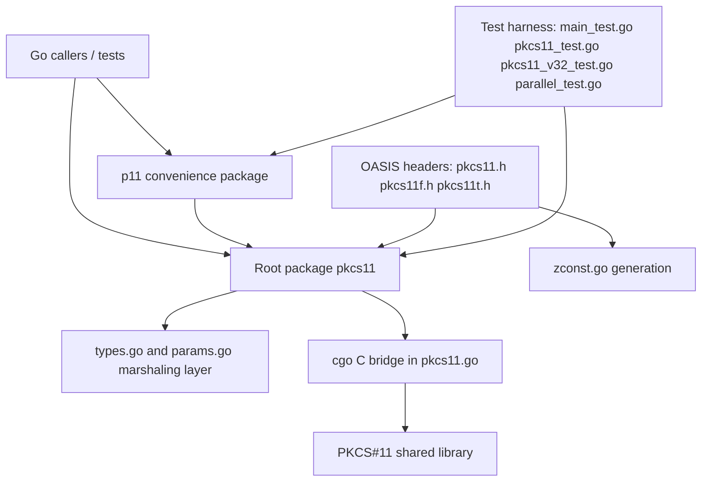
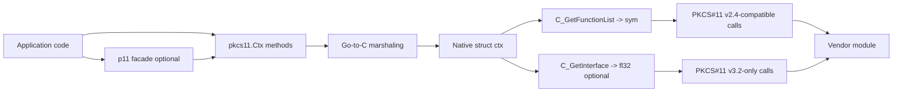

# Architecture Diagrams

## Purpose
This file captures static architecture views that are directly supported by repository code.

## Evidence Base
- `pkcs11.go`
- `types.go`
- `params.go`
- `p11/module.go`
- `p11/session.go`
- `p11/object.go`
- `p11/slot.go`
- `README.md`
- `Makefile`

## Repository Architecture
Observed: the repository is split into a low-level PKCS#11 binding, a type/marshaling layer, a higher-level `p11` convenience package, generated/header inputs, and integration-oriented tests.

## Runtime Layer Architecture
Observed in `pkcs11.go`: `Ctx` wraps a native `struct ctx`; the native layer stores the module handle, the classic function table `sym`, and the optional v3.2 table `fl32`.

## Ownership Boundaries
- The repository owns the Go wrapper, cgo bridge, type conversions, and helper abstractions.
- The repository does not own the internals of the loaded vendor PKCS#11 module.
- Generated/header assets are build inputs and API definitions, not separate runtime services.
