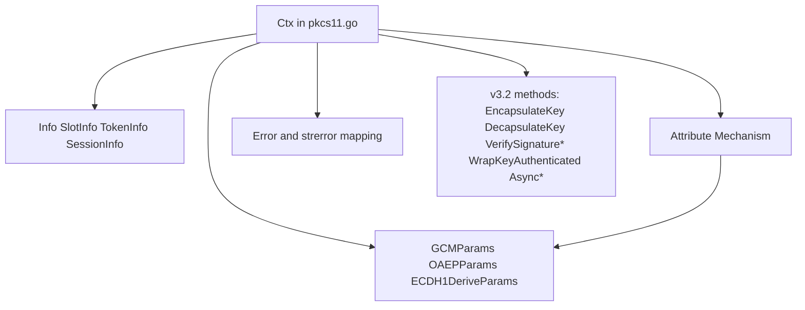
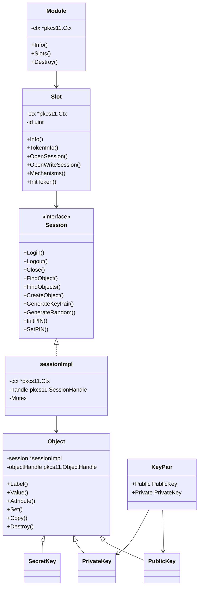
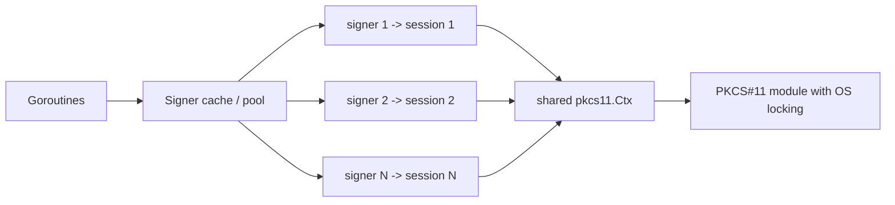

# Component Diagrams

## Purpose
This file captures component and type-relationship views for the root package and `p11` package.

## Evidence Base
- `pkcs11.go`
- `types.go`
- `params.go`
- `p11/module.go`
- `p11/slot.go`
- `p11/session.go`
- `p11/object.go`
- `p11/crypto.go`
- `p11/secret_key.go`

## Root Package Components
Observed: the root package centers on `Ctx`, which coordinates lifecycle, slot/session operations, object operations, crypto operations, and v3.2 extensions.

## `p11` Object Model
Observed from `p11/module.go`, `p11/slot.go`, `p11/session.go`, `p11/object.go`, `p11/crypto.go`, and `p11/secret_key.go`.

## Session Concurrency Component View
Observed: `sessionImpl` serializes per-session operations with a mutex, while `parallel_test.go` demonstrates multi-session concurrency via a signer pool.

