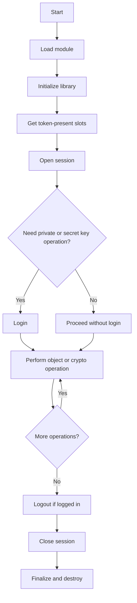
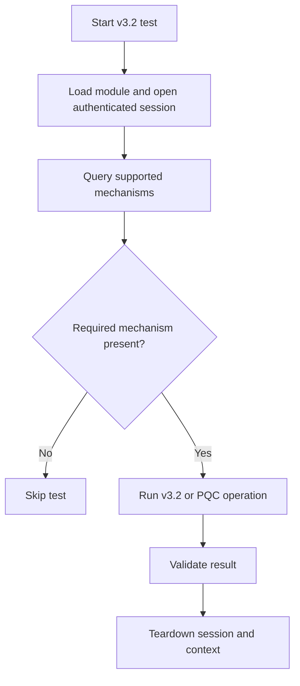
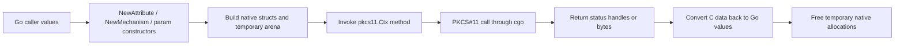
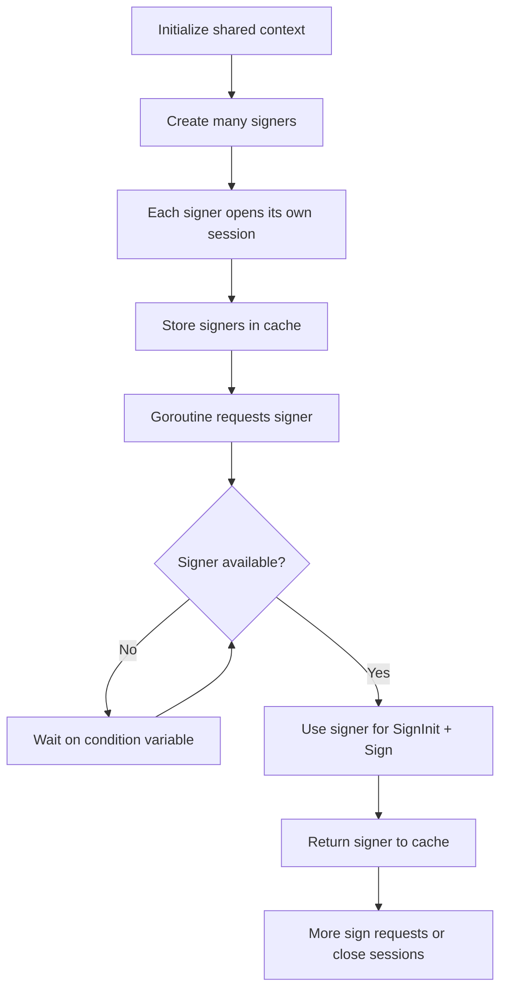

# Flow Diagrams

## Purpose
This file captures decision-oriented and lifecycle-oriented flows derived from the codebase.

## Evidence Base
- `README.md`
- `types.go`
- `params.go`
- `main_test.go`
- `pkcs11_test.go`
- `pkcs11_v32_test.go`
- `parallel_test.go`

## Caller Operation Flow
Observed from `README.md` and `pkcs11_test.go`.

## v3.2 Mechanism-Gated Test Flow
Observed from `pkcs11_v32_test.go`.

## Attribute and Parameter Marshaling Flow
Observed from `types.go` and `params.go`.

## Parallel Signing Resource Flow
Observed from `parallel_test.go`.

