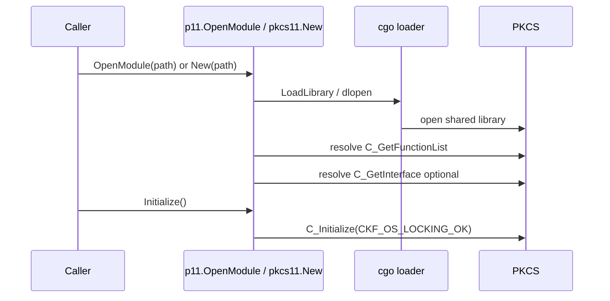
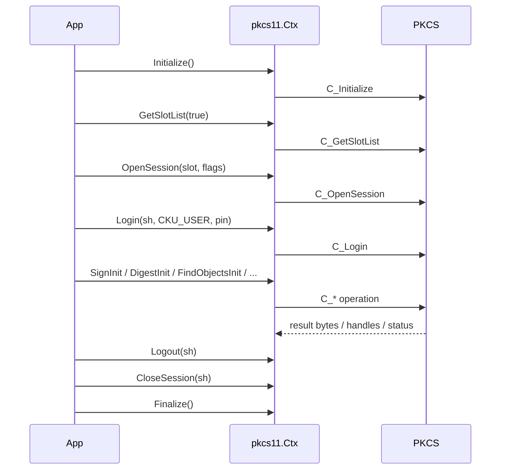
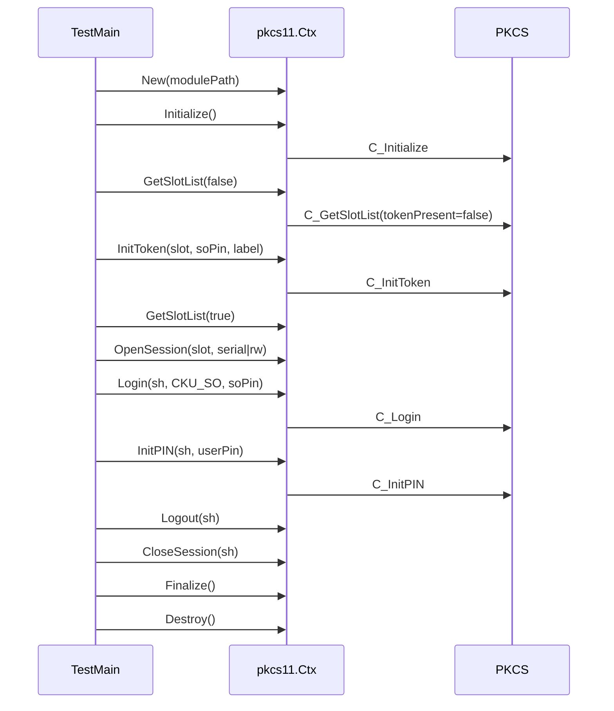
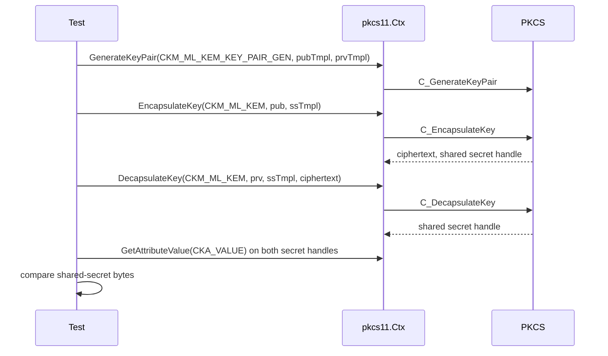
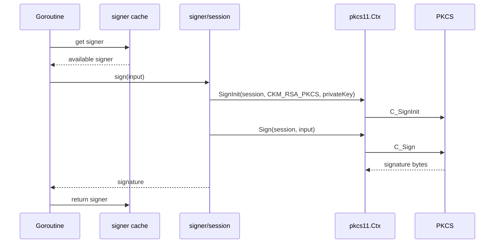

# Sequence Diagrams

## Purpose
This file captures operational sequences that are exercised by code and tests.

## Evidence Base
- `pkcs11.go`
- `p11/module.go`
- `main_test.go`
- `pkcs11_test.go`
- `pkcs11_v32_test.go`
- `parallel_test.go`

## Module Load and Initialization
Observed from `pkcs11.go` and `p11/module.go`.

## Standard Session Lifecycle
Observed from `README.md`, `pkcs11_test.go`, and `pkcs11_v32_test.go`.

## Token Bootstrap Sequence
Observed from `main_test.go`.

## ML-KEM Round-Trip Sequence
Observed from `pkcs11_v32_test.go`.

## Parallel Signing Sequence
Observed from `parallel_test.go`.

